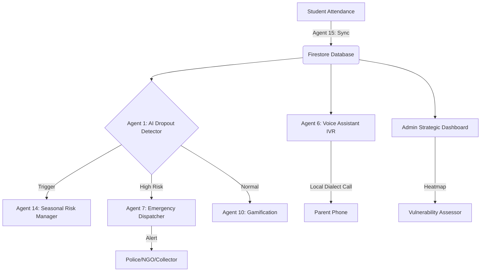

# 🛡️ KALVI KAVALAR (கல்வி காவலர்)
### *Education Guardian: Empowering Rural Girls in Theni, Tamil Nadu*

**KALVI KAVALAR** is a high-complexity, AI-driven ecosystem designed to proactively identify and prevent school dropouts among rural girls, specifically in the **Theni district** of Tamil Nadu. By combining predictive analytics, localized voice-first engagement, and community-driven mentorship, the platform acts as a digital safety net for the next generation of women leaders.

---

## 🛑 1. The Problem Statement
Rural girl students in Theni face a distinct set of challenges that lead to high dropout rates, especially during transition years (Grades 8-10):
*   **Economic Seasonal Cycles**: Peak harvest seasons (Grapes, Tea) often force girls into child labor to support family income.
*   **Cultural Pressures**: Negative parental attitudes towards higher education and the persisting risk of child marriage.
*   **Infrastructure Gaps**: Lack of immediate notification systems for schools and parents when a student is absent.
*   **Literacy Barriers**: Traditional text-based apps fail to engage parents with low literacy levels.

---

## 💡 2. The Solution: A Multi-Platform Ecosystem
Kalvi Kavalar is not just an app; it is a **15-Agent AI Intelligence System** distributed across four specialized interfaces:

### 🌟 Student App (Empowerment Theme)
*   **Theme**: Magenta & Gold (Strength & Excellence).
*   **Impact**: Uses gamification (Kalvi Coins) and a persistent **Fire Streak** to reward consistency.
*   **Logic**: Connects girls to localized success stories to build aspiration.

### 🎧 Parent App (Trust & Ease Theme)
*   **Theme**: Green & Orange (Growth & Stability).
*   **Accessibility**: A **Voice-First** interface allowing mothers to "Listen" to their daughter's updates via IVR (Theni dialect) without needing to read text.

### 📊 Admin Dashboard (Strategic Intelligence)
*   **Theme**: Dark Slate & Indigo (Mission Control).
*   **Strategic View**: Real-time **Vulnerability Heatmaps** and automated **Emergency Triage** for district-level coordinators.

### 🏫 Teacher Kiosk
*   **Simplicity**: Rapid attendance marking with automated offline-sync agents for rural edge connectivity.

---

## 🧠 3. AI Architecture: The 15 Intelligence Agents
The system's "Brain" is distributed into 15 specialized agents:

| Agent Category | Agents Involved |
| :--- | :--- |
| **Predictive** | **Agent 1**: Dropout Detector (Genkit AI), **Agent 14**: Seasonal Risk Manager. |
| **Communication** | **Agent 2**: Parent Communicator, **Agent 6**: Voice Assistant (Tamil IVR). |
| **Intervention** | **Agent 7**: Emergency Dispatcher, **Agent 5**: Optimizer. |
| **Support** | **Agent 3**: Matchmaker, **Agent 9**: Scholarship Finder, **Agent 8**: Translator. |
| **Engagement** | **Agent 4**: Content Personalizer, **Agent 10**: Gamification Engine. |
| **Infrastructure** | **Agent 11**: Teacher Copilot, **Agent 12**: Vulnerability Assessor, **Agent 13**: Mentor Monitor, **Agent 15**: Sync Manager. |

---

## 🛠️ 4. Tech Stack
*   **Frontend**: Next.js 14+, TypeScript, Tailwind CSS.
*   **Animations**: Framer Motion (Physics-based springs, staggered orchestrations).
*   **AI Backend**: Google Genkit AI (Predictive Flows), Node.js.
*   **Database**: Firebase Firestore (Production-grade RBAC rules, real-time sync).
*   **APIs**: Twilio/Voice (Tamil IVR), Google Maps (Heatmaps).
*   **Design**: StitchMCP (High-fidelity UI mockups).

---

## 🏢 5. Architecture Overview

---

## 🌍 6. Real-Life Impact Scenarios

### Scenario A: The Harvest Migration (Seasonal Risk)
*   **Trigger**: In July (Grapes Harvest), a Grade 9 student in **Andipatti** misses two days.
*   **AI Action**: Agent 14 flags this as high risk. Agent 1 calculates a **127.5% risk score**.
*   **Result**: The Parent (Maltathi) receives an automated IVR call in her local dialect explaining the value of finishing the school year, while the local NGO is notified to visit.

### Scenario B: The Aspiration Gap (Content/Mentor)
*   **Trigger**: A student expresses interest in Nursing.
*   **AI Action**: **Agent 3 (Matchmaker)** identifies a Theni-native nurse who recently graduated.
*   **Result**: The **Student App** displays a personalized success story and offers a call with the mentor, funded by **Agent 9 (Scholarship Finder)** discoveries.

---

## 🚀 Getting Started
1.  **Clone the Repo**: `git clone https://github.com/penjendru01varun/Vidhai`
2.  **Install Deps**: `npm install`
3.  **Run Simulation**: `node scripts/simulate_seasonal_risk.js`
4.  **Launch Dashboard**: `npm run dev`

---
*Developed for the Empowerment of Rural Girls in India.* 🇮🇳
