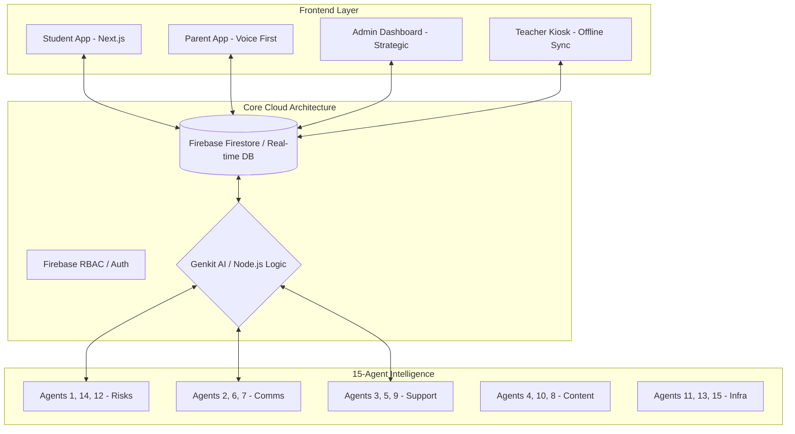
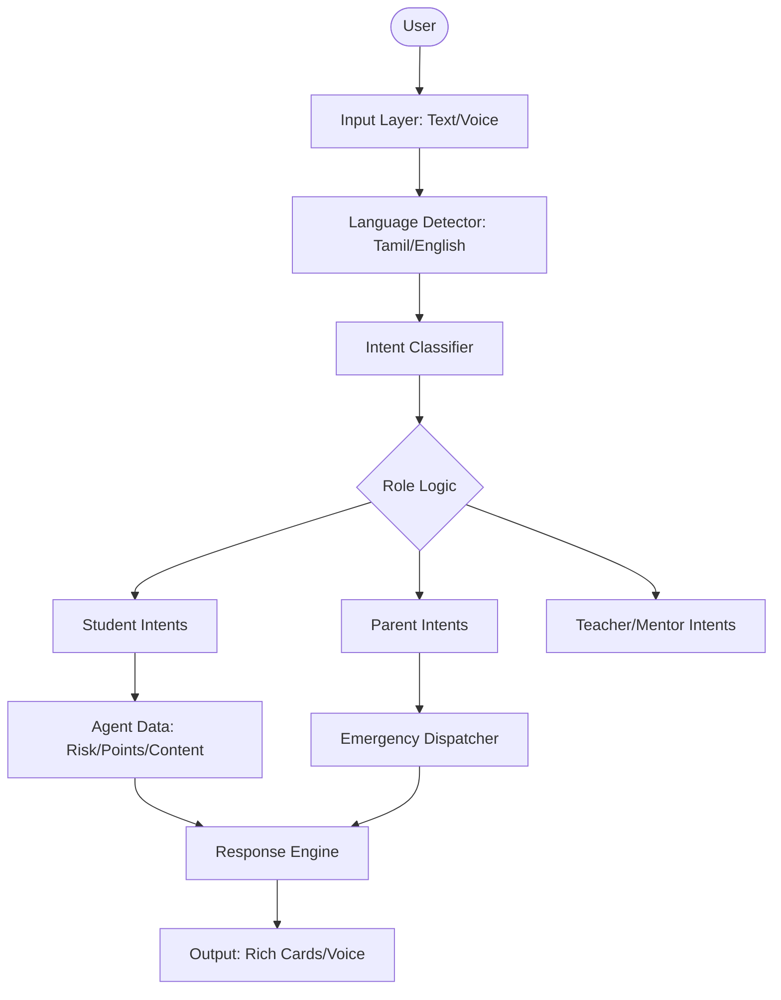
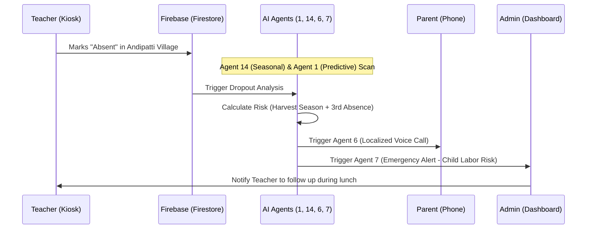

# KALVI KAVALAR
### *Education Guardian: Empowering Rural Girls in Theni, Tamil Nadu*

**KALVI KAVALAR** is a high-complexity, AI-driven ecosystem designed to proactively identify and prevent school dropouts among rural girls, specifically in the **Theni district** of Tamil Nadu. By combining predictive analytics, localized voice-first engagement, and community-driven mentorship, the platform acts as a digital safety net for the next generation of women leaders.

---

## 1. Problem Statement
Rural girl students in Theni face a distinct set of challenges that lead to high dropout rates, especially during transition years (Grades 8-10):
*   **Economic Seasonal Cycles**: Peak harvest seasons (Grapes, Tea) often force girls into child labor to support family income.
*   **Cultural Pressures**: Negative parental attitudes towards higher education and the persisting risk of child marriage.
*   **Infrastructure Gaps**: Lack of immediate notification systems for schools and parents when a student is absent.
*   **Literacy Barriers**: Traditional text-based apps fail to engage parents with low literacy levels.

---

## 2. Overall System Architecture
The KALVI KAVALAR ecosystem consists of 4 distinct frontend interfaces powered by a central Firebase Firestore real-time database and a cluster of 15 AI Agents.

### 🏗️ Architecture Diagram

### 🤖 Kalvi Thunai (Intelligent Chatbot)
**Kalvi Thunai** (Education Companion) is the bilingual, AI-powered interface that connects students, parents, and teachers to the 15-agent system through a friendly chat interface.

#### 🧠 Chatbot Architecture

---

## 3. The Solution: A Multi-Platform Ecosystem
Kalvi Kavalar is not just an app; it is a **15-Agent AI Intelligence System** distributed across four specialized interfaces:

### Student App (Empowerment Theme)
*   **Theme**: Magenta & Gold (Strength & Excellence).
*   **Impact**: Uses gamification (Kalvi Coins) and a persistent **Fire Streak** to reward consistency.

### Parent App (Trust & Ease Theme)
*   **Theme**: Green & Orange (Growth & Stability).
*   **Accessibility**: A **Voice-First** interface allowing mothers to listen to their daughter's updates via automated calls without needing to read text.

### Admin Dashboard (Strategic Intelligence)
*   **Theme**: Dark Slate & Indigo (Mission Control).
*   **Strategic View**: Real-time **Vulnerability Heatmaps** and automated **Emergency Triage** for district-level coordinators.

### Teacher Kiosk
*   **Simplicity**: Rapid attendance marking with automated offline-sync agents for rural edge connectivity.

---

## 4. Operational Workflow (Data Flow)
How the system reacts when a student is absent during a harvest season:

### 🌊 Data Flow Diagram

---

## 5. Deep-Dive: The 15 AI Intelligence Agents
The heart of Kalvi Kavalar is its distributed intelligence. Each agent performs a specific, critical role in the dropout prevention funnel:

### Core Agents
1.  **Predictive Dropout Detector**: Uses Google Genkit AI to analyze historical attendance, academic performance, and household socio-economics to generate a real-time "Dropout Risk Score."
2.  **Smart Parent Communicator**: Orchestrates communication. It learns when parents are most likely to answer (e.g., after harvest shifts) and chooses between SMS, WhatsApp, or IVR based on historical response rates.
3.  **Community Matchmaker**: Uses geolocation and interests to pair high-risk girls with successful regional mentors (e.g., a local nurse or teacher) to build aspiration.
4.  **Content Personalizer**: Generates custom educational snippets and empowerment stories delivered through the student app, specifically tailored to the girl's current grade and career interests.
5.  **Intervention Optimizer**: Continuously analyzes which intervention types (e.g., a phone call vs. a mentor visit) work best for specific villages in Theni, refining the system's strategy automatically.

### Advanced Agents
6.  **Voice Assistant Agent**: Manages the complex state-machine for automated IVR calls. It generates speech patterns that mimic local Theni sub-dialects to increase trust with parents.
7.  **Emergency Alert Dispatcher**: Triggers hierarchical emergency protocols when a severe risk (like predicted child marriage or labor) is detected, notifying school officials, NGOs, and child welfare authorities.
8.  **Multilingual Translator**: Automatically converts educational content and career modules between English and Tamil, ensuring that language is never a barrier to high-quality learning.
9.  **Scholarship Discovery Agent**: Scans state and central government scholarship portals for eligibility criteria, matching students with financial aid they might otherwise miss.
10. **Attendance Gamification Engine**: Calculations and management of the "Kalvi Coins" economy and "Fire Streaks," driving engagement through psychological rewards and milestone achievements.

### Infrastructure & Operations Agents
11. **Teacher Copilot**: Automates the generation of monthly reports for principals and government auditors, summarizing attendance trends and flagging students who need classroom intervention.
12. **Vulnerability Assessor**: Aggregates data across villages to identify "Hotspots" (e.g., Andipatti vs. Periyakulam) for district-wide strategy planning on the Admin Dashboard.
13. **Mentor Performance Monitoring**: Evaluates the impact of mentorship pairings by tracking the student's attendance and academic improvement after being matched.
14. **Seasonal Risk Manager**: A critical local intelligence agent that increases risk thresholds during peak harvest seasons (Grapes/Coffee) in Theni, preemptively alerting parents about the long-term cost of child labor.
15. **Conflict Resolution & Sync Manager**: Ensures data integrity in rural areas. When teachers mark attendance offline, this agent resolves conflicts when the device reconnects to a 4G/5G network.

---

## 6. Tech Stack
*   **Frontend**: Next.js 14, TypeScript, Tailwind CSS.
*   **Animations**: Framer Motion (Advanced physics, staggered flows, persistent micro-animations).
*   **AI Framework**: Google Genkit AI (Predictive Modeling & Flows).
*   **Backend**: Firebase Firestore (Real-time data architecture with hierarchical security).
*   **Voice Integration**: Simulated Localized IVR Logic.

---
*Developed for the Empowerment of Rural Girls.*
